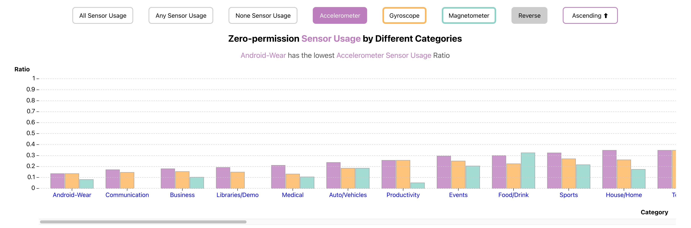

# ARMOUR Visualization


[ARMOUR](https://github.com/longyan97/ARMOUR) is a lightweight Android privacy-enhancement tool for detecting **zero-permission sensor access** by third-party apps at runtime, directly from **user space**—no root, no permissions required. This repository is a visualization tool for ARMOUR's sensor data, allowing users to explore and analyze the collected sensor data from various Android devices.

For now, we just provide sample data and demonstrate its visualization below. The code for data collection and processing will be open-sourced soon.

## Project Structure

- `src/` - Main source code
  - `lib/components/` - Svelte components for different visualizations
  - `routes/` - Application routes and main pages
  - `style.css` - Global styles
- `build/` - Production build output
- `static/` - Static assets (datasets, images, logos)
- `images/` - Project images and demo screenshots

## Getting Started

### Prerequisites
- Node.js (v16 or higher recommended)
- npm or yarn

### Installation
```bash
npm install
```

### Development
```bash
npm run dev
```
Open your browser and navigate to the local server URL (usually http://localhost:5173).

### Build for Production
```bash
npm run build
```

### Preview Production Build
```bash
npm run preview
```

## Visualization Details and Results

### 1. Bar Chart: Sensor Usage by Category



Shows the proportion of zero-permission sensor usage (accelerometer, gyroscope, magnetometer) across different app categories.
- Supports filtering and sorting by sensor type, highlighting categories with the lowest or highest usage rates.
- Allows toggling between all sensor usage, any sensor usage, and no sensor usage.
- Interactive features:
    - Clicking a bar sorts by that category; clicking again toggles the sort order.
    - Clicking an X-axis category filters/adds that category to the visualization; supports select all and invert selection.
    - The first category on the X-axis will be used for the per-app demo in [### 4. Demo Charts: Per-App Sensor Usage Details].

### 2. Violin/Raincloud Plot: Frequency Distribution


Displays the sampling frequency distribution of each sensor type across different runtime stages (e.g., foreground, background, installation, uninstallation). The distribution is not random but concentrated in specific frequency ranges. The violin plot shape and density help users intuitively understand the concentration and spread of sensor usage.

Buttons above the plot allow filtering and comparing sensor usage across runtime stages, helping users quickly identify abnormal usage patterns.

### 3. Pie Chart: Sensor Usage Changes at Runtime Transitions


Shows trends in sensor usage changes during runtime transitions (e.g., installation to foreground, foreground to background). Colors and proportions visually reflect increases or decreases in sensor usage during stage transitions. For example, sensor usage may peak during "installation to foreground" and then gradually decrease.

A threshold slider above the chart adjusts the sensor usage threshold, helping users focus on sensors with frequencies of interest.

### 4. Demo Charts: Per-App Sensor Usage Details


Provides a comprehensive view of detailed sensor usage for a single app, grouped by runtime stage. Reveals synchronization patterns of multi-sensor activation within apps and supports comparative analysis of sensor usage patterns across different apps.

These visualization tools not only improve data readability but also help users quickly identify anomalies and understand behavioral patterns of sensor usage, providing strong support for privacy protection and security analysis.

## Data

The sensor data are located in the `static/`:
- `OnePlus-12-Armour-Sensor_data.csv`
- `S9-10-Armour-sensor_data.csv`
- Corresponding JSON files for metadata

### Data Field Explanation


- **Category**: The application category (e.g., Android-Wear)
- **CategoryIndex**: Index number for the category
- **VendorIdentifier**: Unique identifier for the app
- **Sensor**: Type of sensor (e.g., Accelerometer, Gyroscope, Magnetometer)
- **Region**: The context or stage of data collection (e.g., FG=Foreground, BG=Background, INSTL=Installation, STOP=Force Stopping, RM=Uninstallization)
- **PatternIndex**: Index for the detected behavior or pattern in one region
- **Frequency**: Sampling frequency of the sensor data
- **Start**: Start timestamp of a specific frequency
- **End**: End timestamp of a specific frequency
- **Duration**: Durartion of a specific frequency

## Adding New Data

Todo

<!-- To add new datasets, place your CSV and JSON files in the `static/` directory and update the relevant Svelte components to load and visualize the new data. -->

## License (TODO)

This project is for academic and research purposes. Please contact the authors for licensing information.

## Acknowledgments

This project is from a course project for "CS7250 41152 Info Viz Theory and Appls SEC 02 Spring 2025 [BOS-2-TR]" at Northeastern University. It was developed by [Jiancong Cui](https://jiancongcui.github.io/) and [Hui Zhuang](https://zhuang-hui.github.io/) under the guidance of course instructor [Prof. Enrico Bertini](https://vis.khoury.northeastern.edu/) and teaching assistant [Daniel Kerrigan](https://vis.khoury.northeastern.edu/people/Daniel-Kerrigan/). We thank them for their valuable feedback and support.

---
For questions or contributions, please open an issue or submit a pull request.